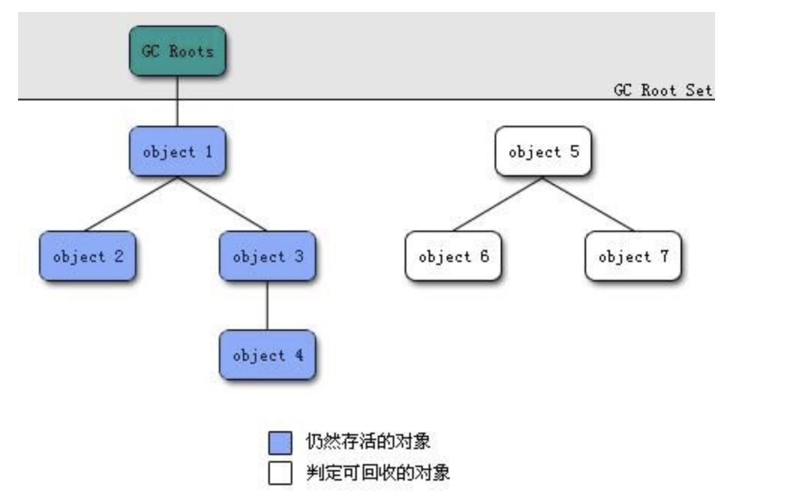
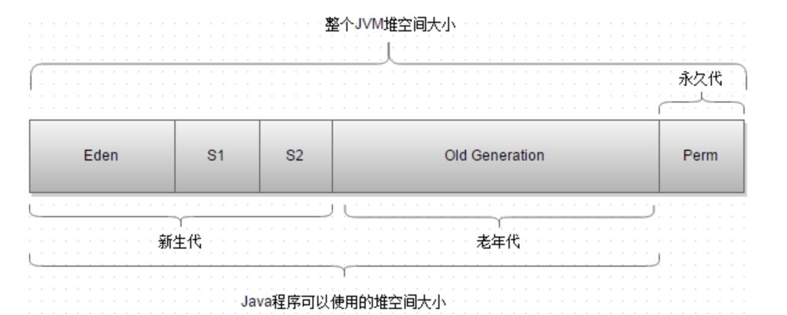

# jvm内存结构(运行时数据区)

* jdk8 开始移除了永久代，变成了Metaspace(元空间，存储类信息之类)，常量池移动到了方法区

# java 对象模型


# 垃圾收集器
## 对象是否存活使用的算法
* 引用计数法
* 可达性分析
    * 图例
    

    * 可作为GC root的对象
        * 虚拟机栈中中，栈帧中本地变量表中引用的对象
        * 方法区中类静态属性引用的对象
        * 方法区中常量引用的对象
        * 本地方法法栈中JNI(native方法)引用的对象
* 引用类型
    * 强引用(strong reference):例如Object o = new Object(),这类就是强引用，只要有强引用存在，垃圾收集器是不会回收掉引用的对象的
    * 软引用(soft reference)：描述一些还有用，但非必须的对象，在系统将要发生内存溢出的异常之前，将会对这类对象列进回收范围，进行二次回收，如果回收后内存还是不够，则会跑出内存溢出的异常
    * 弱引用(weak reference)：也是用来描述非必须对象的，但是强度比软引用更弱一些，被弱引用关联的对象只能生存到下一次垃圾收集发生之前。
    * 虚引用(weak reference):也称之为幽灵引用或者幻影引用，是一种最弱的引用关系。一个对象是否有虚引用的存在，完全不会对其生存时间产生影响，也无法通过虚引用来取得一个对象的实例。设置虚引用关联的唯一目的就是能通过在这个对象被收集器回收时收到一个系统通知。
* **可达性分析若判断一个对象没有引用链，并不是立马就回收这个对象**，而是会对这个对象进行标记然后帅选，筛选的条件是，是否需要执行finalize()方法，该方法只会执行一次。
    * 对象没有覆盖finalize方法或者虚拟机已经执行过，则认为finalize方法不需要执行
    * 若判断需要执行finalize方法，则将对象放置在一个F-Queue的队列中，稍后虚拟机会自建一个低优先级的线程去执行。
    * 虚拟机会执行此方法，不保证此方法可以执行完。
    * 所以finalize的方法中，可能会使对象不会被GC回收，例如将对象的this指针赋值给某个对象或者类的静态变量

## 判断一个类是无用的类

方法区主要回收的是无用的类，那么如何判断一个类是无用的类的呢？

判定一个常量是否是“废弃常量”比较简单，而要判定一个类是否是“无用的类”的条件则相对苛刻许多。类需要同时满足下面3个条件才能算是 “无用的类” ：

* 该类所有的实例都已经被回收，也就是 Java 堆中不存在该类的任何实例。
* 加载该类的 ClassLoader 已经被回收。
* 该类对应的 java.lang.Class 对象没有在任何地方被引用，无法在任何地方通过反射访问该类的方法。

虚拟机可以对满足上述3个条件的无用类进行回收，这里说的仅仅是“可以”，而并不是和对象一样不使用了就会必然被回收

## 垃圾收集算法
* 标记清除法
    * 算法图实例
        * 清除前
        
    
    
        * 清除后
        
        
    * 该算法主要分为两个过程
        * 标记：标记死亡的对象，使用上述GcRoots的方法进行判断
        * 清除：清除被标记的对象
    * 不足
        * 效率问题： 标记和清除两个过程的效率都不高
        * 空间问题： 标记清除之后会产生大量不连续的内存碎片，空间碎片太多可能会导致以后在程序运行过程中需要分配大对象时，无法找到足够的连续的内存而不得不提前触发另一次垃圾收集动作。 
* 复制
    * 算法图解
        * 回收前
        

        * 回收后
            

    * 过程
        * 将内存按容量划分为2块
        * 每次只使用其中一块，当一块内存用完后，就将还存活的对象复制到另一块
        * 然后再把使用过的内存空间一次清理掉
    * 优缺点
        * 优点
            * 每次都对其中一个半块区域进行回收，内存分配的时，不用考虑内存碎片的问题，只需要移动堆顶指针，按顺序分配内存即可，实现简单，运行高效。
        * 缺点
            * 将内存缩小为了原来的一半，代价太大。
            * 复制收集算法在对象存活率较高的时候就要进行多次复制操作，效率将变低。更关键时，如果不想浪费剩余的控件，就需要额外的空间进行分配担保，故老年代一般不能直接选用这种算法。
    * **目前的商业虚拟机都是使用这种垃圾收集算法来回收新生代**
* 标记整理(标记压缩)
    * 图解示例
        * 回收前
            

        * 回收后
            

    * 过程
        * 标记过程和“标记-清除”算法一致
        * 让存活的对象都向一端移动，然后直接清除掉端边界以外的内存
    * 优缺点
        * 优点
            * 不会产生控件碎片
            
* 分代收集
    * 根据对象的存活周期的不同将内存划分为几块，然后根据各个年代的特点采用最适当的手机算法。
        * 新生代：每次垃圾手机时都发现有大批的对象死去，只有少量存活，所以选用复制算法，只需要付出少量存活对象的复制成本就可以完成收集。
        * 老年代：对象的存活率高、没有额外的控件对它进行分配担保，使用“标记-整理”算法进行回收。
    * 算法图解
        

        * S1：from survivor
        * S2：to survivor
        * Eden:S1:S2 = 8:1:1
        * **JDK1.8开始就移除了Perm永久代，取而代之的是MetaSpace元空间，元空间使用的是物理内存**
    * 过程
        * 对象优先在Eden区分配，大部分的对象都是“朝生夕灭”的
        * 当eden区没有足够的空间进行分配时，将触发一次Minor GC，Eden中存活的对象会复制到S2区。
        * S1区中的对象根据对象的年龄进行不同的操作
            * 年龄小于15，复制到S2区
            * 年龄大于15，移动到老年代
            * 对象从Eden去区到Survivor区，对象的GC年龄设置为1，后续对象在Survivor中每经历一次MinorGC，年龄就会增1
                * 动态对象年龄判定：为了更好的适应不同程序的内存情况，虚拟机**不是永远要求对象年龄必须达到了某个值才能进入老年代**，如果 Survivor 空间中相同年龄所有对象大小的总和大于 Survivor 空间的一半，年龄大于或等于该年龄的对象就可以直接进入老年代，无需达到要求的年龄。
        * 清空Eden和S1区
        * 后续就是S1和S2的作用循环往复，GC时将Eden区和S2区存活的对象移动到S1去，然后清空Eden和S2
        * **大对象直接进入老年代，（比如：数组，字符串）**
            * 目的：避免在分配大对象的时候，由于分配担保机制而带来的复制而降低效率
    * MinorGC和Full GC
        * MinorGC：指发生新生代的的垃圾收集动作，Minor GC非常频繁，回收速度一般也比较快
        * Full GC：指发生在老年代的GC，出现了Major GC经常会伴随至少一次的Minor GC（并非绝对），Major GC的速度一般会比Minor GC的慢10倍以上
## hotspot算法实现
* 枚举根节点
    * 可达性分析必须必须在一致性的快照中进行分析，一致性的意思就是：整个分析过程不会发生对象引用的变化，所以jvm需要暂停所有的执行线程，该事件称之为:**STW(stop the worl)**
    * 不需要检查所有的引用(全局性引用及执行上下文中栈帧的局部变量表)的引用位置，jvm应该知道哪些地方存在着引用，hotspot使用OopMap的数据结构来达到这个目的，类加载和JIT编译过程中会记录引用相关信息。
* 安全点
    * hotspot不会为每条指令都生成OooMap，只会在安全点的地方记录这些信息。(若为每条指令都生成OooMap，会耗费大量的空间)
    * 是否让程序长时间执行的特征 为标准进行选定，长时间执行最显著的特征就是指令复用，例如方法调用、循环跳转、异常跳转
    * 安全点线程中断方式
        * 抢先式中断：无需线程执行代码主动配合，发生GC时直接中断，在让未跑至安全点的线程恢复跑到安全点
        * 主动式中断：GC需要中断线程时，不直接操作线程，仅设置一个标志位，线程轮询这个标志位，进而主动中断挂起。
* 安全区域
    * 一段代码片段之中，引用关系不会发生变化，此时在任何一个点进行GC都是安全的。
    * 主要是为了解决程序不执行时(线程sleep的情况)，无法响应中断信号。
    
## 垃圾收集器分类


> 连线部分表示可以连个可以搭配使用的收集器

## Serial


* 新生代收集器
* 单线程，GC时会触发STW
* 简单高效，主要应用于client模式下的JVM，由于client模式下，分配的内存一般较小，所以停顿时间会比较小。

## ParNew收集器


* serial收集器的多线程版本，二者复用了很多代码
* 目前是和CMS唯一的并发收集器，在选择使用CMS收集器的时候，默认新生代使用的就是ParNew


## Parallel Scavenge 收集器
* 多线程收集器
* 关注点在于吞吐量
* 吞吐量 = CPU运行用户代码的执行时间/(CPU运行用户代码时间+CPU运行垃圾收集算法的时间)，吞吐量高，更加适用于服务端计算程序，和用户无太多交互的程序。
* 支持GC的自适应调节策略

## Serial OLd收集器
* serial收集器的老年代版本，与serial类似
* CMS收集器的后备预案，在发生Concurrent Mode Failure时使用
* 使用标记整理算法

## Parallel old
* parallel Scavenge的老年代版本

## CMS收集器(concurrent mark sweep)


* 以获取最短回收停顿时间为目标的收集器
* 基于标记-清楚算法
* 步骤
    * 初始标记
        * 触发STW
        * 标记GC Roots能直接关联到的对象
    * 并发标记
        * GC Roots traceing的过程
    * 重新标记
        * 修正并发标记阶段因用户线程继续运作而导致标记产生变动的那一部分对象的标记记录
    * 并发清除
* 缺点
    * 对CPU资源敏感
    * 无法处理浮动垃圾，可能出现concurrent mode failure错误，由于使用CMS收集器，GC时用户线程是继续运行的，所以需要预留老年代的部分空间供用户线程使用，使用-XX:CMSInitiatingOccupancyFraction值来设置，例如设置70%，则当老年代医用内存达到70%的时候，会触发垃圾回收。如果CMS预留的内存无法满足程序需要，则会触发concurrent mode failure，此时就会触发后备预案：serial old
    * 由于使用标记-清除算法，会产生大量空间碎片，JVM提供相应的参数，可以让CMS回收后，进行碎片整理工作

## G1收集器
* 优势
    * 并行与并发：充分利用多CPU、多核硬件优势，使用多个CPU缩短STW时间，仍然可以与用户线程并发执行
    * 分代收集：无需和别的收集器搭配使用
    * 空间整合
    * 可预测停顿时间：建立可预测的停顿时间模型，能让使用者明确在一个长度为M毫秒的时间片段内，消耗在垃圾收集上的时间不超过N毫秒

* G1收集器，可管理整个堆，将堆分配为大小相等的多个区域，保留新生代和老年代的概念，但是新生代和老年代不在物理隔离。
* 规避进行全区域的垃圾回收，以优先级回收各个区域，后台维护一个优先级列表，优先级：回收所获取的空间大小和以及回收所需要的时间进行计算
* 

# 内存分配策略
* 对象优先在Eden区分配，当Eden没有足够的空间分配时，jvm会触发一次Minor GC。
* 大对象直接进入到老年代，大对象：需要大量连续内存空间的java对象，最典型的大对象就是长字符串和大数据。
* 长期存活的对象进入老年代
    * minor gc后某个对象可以存活，并且被移动到s区，则给该对象的GC年龄增1，当年龄增到15(默认为15)，就会晋升到老年代。
* 空间分配担保
    1. 检查老年代最大可用连续空间是否大于新生代所有对象总空间，成立，则minor GC是安全。
    2. 若1不成立，则查看HandlePromotionFailure设置值是否允许担保失败，如果不允许冒险，则改为进行一次full gc
    3. 若允许担保失败，检查老年代最大可用连续空间是否大于历次晋升到老年代对象的平均大小，如果大于，则进行一次minor gc
    4. 是否担保失败，则进行一次full gc。

    此处所述的冒险：是由于新生代使用复制算法，当一块s区域无法承受eden与另一块s区的存活对象时，此时就需要将部分对象移动至老年代，所以此时需要去通过一系列运算，判断老年代是否有空间可以接受这些存活的对象。

# 语法糖
* 泛型及类型擦除
    * 伪泛型，只是进行编译时的检查，编译过后的代码，会在使用的地方使用强制类型转化
    * 方法的特征签名
        * 代码层面：方法名称+参数，方法的返回值不包含在特征签名中
        * 字节码层面：特征签名包括返回值，和受检查异常表，范围更大一些
    * 类型擦除只是在方法code属性中进行字节码的擦除，但是类的元数据中还是保留着泛型信息
    * 导致public  void method(List<String> list)，public void method(List<Integer> list)无法进行重载
        * public  String method(List<String> list)
        * public int method(List<Integer> list)
        * 上述连个方法，javac是编译可以通过的，因为字节码层面，返回值是加入到方法特征签名的，所以这种事允许共存的。并且编译器是可以通过泛型类型去判断调用哪个方法的，所以这种形式的重载是允许的。
        * **如果两个泛型方法在擦除泛型信息后，如果只是具有相同的参数类型，而返回值不一样，就可以进行重载**，此种编译类似在**jdk1.7+**已经无法编译通过了，jdk6是可以的。
* 自动装箱拆箱
    * 自动装箱：编译器调用包装类的valueOf将原始类型值，转化为对象
    * 自动拆箱：编译器通过调用类似intValue，doubleValue方法将对象转化为原始类型的值
*  Integer valueof 缓存池问题
    *  缓存了-128到127之间的值,因为负数在计算机中使用反码进行表示，那么存在一个问题[0000000]和[10000000]分别为0和-0，其实是一样的，所以8位中就使用了[00000000]来表示0，[10000000]用来表示-128
*  类型的取值范围
    *  原码，反码，补码(https://www.cnblogs.com/zhangziqiu/archive/2011/03/30/ComputerCode.html)
        *  原码，最高位为符号位，比如+1的原码为 00000001，-1的原码为10000001，所以8位二进制数的取值范围就是[1111111,0111111]即[-127,127]
        *  反码，正数的反码是其本身，负数的反码是符号位不变，其余按位取反
            ```
            [+1] = [00000001]原 = [00000001]反
            [-1] = [10000001]原 = [11111110]反
            ```
            
        *  补码，正数的补码是其本身，负数的补码，在反码的基础上+1
            ```
            [+1] = [00000001]原 = [00000001]反 = [00000001]补
            [-1] = [10000001]原 = [11111110]反 = [11111111]补
            ```
            
        *  补码的引入，是为了解决。让计算计算减法的时候，使用加法去代替
            ```
            1-1 = 1 + (-1) = [0000 0001]原 + [1000 0001]原 = [0000 0001]补 + [1111 1111]补 = [0000 0000]补=[0000 0000]原
            ```  
            
     * 并且[10000000]可以用来表示-128
     ```
     (-1) + (-127) = [1000 0001]原 + [1111 1111]原 = [1111 1111]补 + [1000 0001]补 = [1000 0000]补
     ```       
* 条件编译
    * 例子
    
        ```java
        public class Hello { 
            public static void main(String[] args) { 
                if(false) { 
                    System.out.println("Hello, world!"); 
                } 
            } 
        }
        
        此段代码经过编译后，产生的字节码文件反编译后查看如下 
        
         public class Hello { 
            public static void main(String[] args) { 
            } 
        }
        ```
    * 编译器在编译时会对代码进行优化，对于条件永远为false(需要时常量分支，final修饰的变量)的语句，java编译器将不会对其生成字节码。
        
* 变长参数
    * 编译器将变长参数包装成一个数组，所以在重载方法是，String[] args和String... vars会被当作是相同签名的方法，故在源码级别是不可能同时存在，所以无法编译通过的。
* 遍历循环
    * 遍历循环编译器会编译为迭代器的迭代的方式
* 内部类
    * outer.java里面定义了一个内部类inner，编译器，会生成连个完全不相同的class文件，分别是outer.class和outer$inner.class
    * 成员内部类
        * 作为外部类的一个成员，故可以无限制的访问外部类的所有成员属性和方法
        * 外部类需要通过内部类的实例访问内部类的属性
    * 局部内部类和匿名内部类
        * 局部内部类嵌套在方法和作用域
        * 局部内部类和匿名内部类引用外部变量时，外部的变量需要final
        * 为什么引用的变量要声明为final，因为若未声明为final，则在方法运行完毕后，局部变量会被回收，在可能出现内部类在引用一个不存在的局部变量。将局部变量声明为final，局部变量在被clean up时，会把final局部变量替换成常量，即将局部变量编程局部内部类变量的数据成员，这也就是java的闭包
    * 静态内部类
* 枚举类
    * 编译器会将枚举类编译成一个普通类（继承java.lang.Enum）
    * 并且添加一个values的方法和valueof方法
* 断言语句
* 对枚类
* 字符串的switch支持(jdk1.7+)
    * int类型：直接比较整数值
    * char类型：比较ascii码
    * String类型：使用hashCode和equal方法
    
    ```
        public class switchDemoString {
            public static void main(String[] args) {
                String str = "world";
                switch (str) {
                case "hello":
                    System.out.println("hello");
                    break;
                case "world":
                    System.out.println("world");
                    break;
                default:
                    break;
                }
            }
        }
        
        class文件反编译
        public class switchDemoString
        {
            public switchDemoString()
            {
            }
            public static void main(String args[])
            {
                String str = "world";
                String s;
                switch((s = str).hashCode())//使用了hashcode
                {
                default:
                    break;
                case 99162322:
                    if(s.equals("hello"))
                        System.out.println("hello");
                    break;
                case 113318802:
                    if(s.equals("world"))
                        System.out.println("world");
                    break;
                }
            }
        }
    ``` 
    * **switch只能使用int类型,其他的数据类型是转换成整形之后再使用switch case的**
* try语句中定义和关闭资源（try-with-resource）
    * try-catch-finally
    
    ```
    public class Demo {
        public static void main(String[] args) {
            BufferedInputStream bin = null;
            BufferedOutputStream bout = null;
            try {
                bin = new BufferedInputStream(new FileInputStream(new File("test.txt")));
                bout = new BufferedOutputStream(new FileOutputStream(new File("out.txt")));
                int b;
                while ((b = bin.read()) != -1) {
                    bout.write(b);
                }
            }
            catch (IOException e) {
                e.printStackTrace();
            }
            finally {
                if (bin != null) {
                    try {
                        bin.close();
                    }
                    catch (IOException e) {
                        e.printStackTrace();
                    }
                    finally {
                        if (bout != null) {
                            try {
                                bout.close();
                            }
                            catch (IOException e) {
                                e.printStackTrace();
                            }
                        }
                    }
                }
            }
        }
    }
    ```
    * try-with-resource 
       
    ```
    public class TryWithResource {
        public static void main(String[] args) {
            try (BufferedInputStream bin = new BufferedInputStream(new FileInputStream(new File("test.txt")));
                 BufferedOutputStream bout = new BufferedOutputStream(new FileOutputStream(new File("out.txt")))) {
                int b;
                while ((b = bin.read()) != -1) {
                    bout.write(b);
                }
            }
            catch (IOException e) {
                e.printStackTrace();
            }
        }
    }
    ```
    
    * 使用try-with-resource,资源必须实现AutoClosable接口，重写close方法
    
    ```
        public class Connection implements AutoCloseable {
            public void sendData() {
                System.out.println("正在发送数据");
            }
            @Override
            public void close() throws Exception {
                System.out.println("正在关闭连接");
            }
        }
        
        public class TryWithResource {
            public static void main(String[] args) {
                try (Connection conn = new Connection()) {
                    conn.sendData();
                }
                catch (Exception e) {
                    e.printStackTrace();
                }
            }
        }
        
        class反编译结果:
        
        public class TryWithResource {
            public TryWithResource() {
            }
            public static void main(String[] args) {
                try {
                    Connection e = new Connection();
                    Throwable var2 = null;
                    try {
                        e.sendData();
                    } catch (Throwable var12) {
                        var2 = var12;
                        throw var12;
                    } finally {//自动生成了finally语句块
                        if(e != null) {
                            if(var2 != null) {
                                try {
                                    e.close();
                                } catch (Throwable var11) {
                                    var2.addSuppressed(var11);//解决异常屏蔽问题
                                }
                            } else {
                                e.close();
                            }
                        }
                    }
                } catch (Exception var14) {
                    var14.printStackTrace();
                }
            }
        }
    ```
    
    


# java内存模型(线程内存模型)


* happens-before规则
《JSR-133:Java Memory Model and Thread Specification》中定义
    * **程序顺序规则**:一个线程中的每个操作，happens-before于该线程中的任意后续操作
    * **监视器锁规则**:对一个锁的解锁，happens-before于随后对于这个锁的加锁
    * **volatile变量规则**:对一个volatile域的写，happens-before于任意后续对这个volatile域的读
    * **传递性**:如果A happens-before B,且B happens-before C,那么A happens-before C
    * **start()规则**:如果线程A执行操作ThreadB.start()(启动线程B),那么A线程的ThreadB.start()操作happens-before于线程B中的任意操作
    * **join()规则**:如果线程A执行操作ThreadB.join()并成功返回，那么线程B中的任意操作happens-before于线程A从ThreadB.join()操作成功返回

# JDK命令
* jps(jvm process status tool )
    显示制定下系统内所有hotspot虚拟机进程
* jstat(jvm statistics Monitoring tool)
    监视虚拟机各种运行状态信息
* jinfo(configuration info for java)
    实时查看和调整虚拟机的个性参数
* jmap(memory map for java)
    生成堆转储快照,查询finalize执行队列，Java堆和永久代的详细信息，如空间使用率、当前使用的垃圾收集器的类型
* jhat(jvm heap analusis tool)
    虚拟机堆转储快照分析工具,一般都是使用mat对堆dump进行分析
* jstack(stack trace for java)
    java堆栈跟踪工具，生成线程快照
* HSDIS
    JIT生成代码反汇编
* BTrace
    visualVM的插件，动态日志追踪，程序运行时，增量加入日志代码，以调试程序
* HSDB
    sudo java -cp /Library/Java/JavaVirtualMachines/jdk1.8.0_161.jdk/Contents/Home/lib/sa-jdi.jar sun.jvm.hotspot.HSDB        
