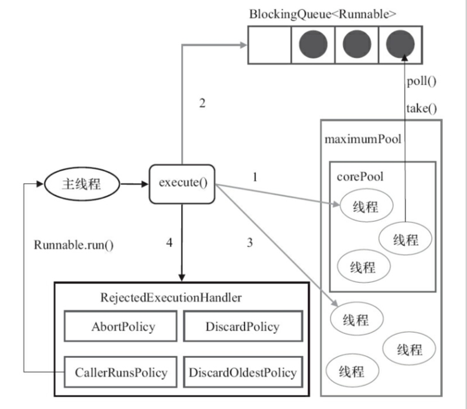

# 线程池
## 实现模型


1. 当前运行的线程数小于corePoolSize，则创建线程来执行任务(注意，执行这一步骤需要获取全局锁)
2. 如果运行的线程等于或大于corePoolSize，则将任务将入BlockingQueue
3. 如果无法将任务加入到BlockingQueue(队列已满)，则创建新的线程来处理任务(注意，执行这一步骤需要获取全局锁)
4. 如果创建新线程将使当前运行的线程超出maximumPoolSize，任务将被拒绝，并调用RejectedExecutionHandler.rejectedExecution()方法。饱和策略如下（队列和线程都满了的情况下，才采取拒绝策略）：
    1. AbortPolicy：直接抛出异常
    2. CallerRunsPolicy：只有调用者所在线程运行任务
    3. DiscardOldestPolicy:丢弃队列里最近的一个任务，并执行当前任务
    4. DiscardPolicy:不处理，丢弃掉。

ThreadPoolExcutor采取上述步骤的总体设计思路，是为了在执行excute()方法时，尽可能地避免获取全局锁(是一个严重的可伸缩瓶颈)。在ThreadPoolExecutor完成预热之后（当前运行的线程数大于等于corePoolSize），几乎所有的execute（）方法调用都是执行步骤2，而步骤2不需要获取全局锁。

## 线程池的初始化
```java
ThreadPoolExecutor(int corePoolSize,
                              int maximumPoolSize,
                              long keepAliveTime,
                              TimeUnit unit,
                              BlockingQueue<Runnable> workQueue,
                              ThreadFactory threadFactory,
                              RejectedExecutionHandler handler)
```

* corePoolSize(线程池的基本大小)
    * 当提交一个任务到线程池时，线程池会创建一个线程来执行任务，即使其他空闲的基本线程能够执行新任务也会创建线程，等到需要执行的任务数大于线程池的基本大小时就不再创建。如果调用了线程池的prestartAllCoreThreads()，线程池会提前创建并且启用所有基本线程。
* runnableTaskQueue(任务队列)：用于保存等待执行的任务的阻塞队列。可以选择一下几个阻塞队列
    * ArrayBlockingQueue：基于数组的有界阻塞队列，FIFO(先进先出)
    * LinkedBlockingQueue：一个基于链表结构的阻塞队列，此队列按FIFO排序元素，吞吐量通常高于ArrayBlockingQueue。Excutors.nexFixedThreadPool使用这个队列。
    * SynchronousQueue：一个不存储元素的阻塞队列。每个插入操作必须等到另一个线程调用移除操作，否则插入操作一直处于阻塞状态，吞吐量通常要高于LinkedBlockingQueue,静态工厂方法Executors.newCacheThreadPool使用这个队列。
    * PriorityBlockingQueue:一个具有优先级的无线阻塞队列。
* maximumPoolSize（线城池最大线程数）：线程池允许创建的最大线程数。如果队列满了，并且已创建的线程数小于最大线程数，则线程池会再创建新的线程执行任务。值得注意是，如果使用了无界的任务队列这个参数就没什么效果。
* ThreadFactory:用于设置创建线程的工厂，可以通过线程工厂给每个创建出来的线程设置更有意义的名字。
* RejectedExecutionHandler：饱和策略，当队列和线程满了。可以实现RejectedExecutionHandler接口自定义策略。例如记录日志或持久化存储不能处理的任务。
* keepAliveTime(线程活动保持时间)：线程池的工作线程空闲后，保持的存活时间。所以，如果任务很多，并且每个任务执行的时间比较短，可以调大时间，提高线程的利用率。
* TimeUnit（线程活动保持时间的单位）：可选的单位有天，小时，分钟，毫秒，微妙和纳秒。

## 线程池如何关闭线程
```java

/**
* 工作线程运行的方法
*/
public void run() {
    try {
        hasRun = true;
        Runnable task = firstTask;
        firstTask = null;
        //此处循环获取任务，在没有获取到任务的时候，就会执行workerDone方法
        while (task != null || (task = getTask()) != null) {
            runTask(task);
            task = null;
        }
    } finally {
        workerDone(this);
    }
}

void workerDone(Worker w) {
    final ReentrantLock mainLock = this.mainLock;
    mainLock.lock();
    try {
        completedTaskCount += w.completedTasks;
        workers.remove(w);//删除当前这个worker，删除后，等待GC回收即可
        if (--poolSize == 0)
            tryTerminate();
    } finally {
        mainLock.unlock();
    }
}

Runnable getTask() {
    for (;;) {
        try {
            int state = runState;
            if (state > SHUTDOWN)
                return null;
            Runnable r;
            if (state == SHUTDOWN)  // Help drain queue
                r = workQueue.poll();
            else if (poolSize > corePoolSize || allowCoreThreadTimeOut)
            //当前线程数大于核心线程数的时候，就去任务队列获取任务，如果在keepAliveTime的时间未获取到任务，则返回null
                r = workQueue.poll(keepAliveTime, TimeUnit.NANOSECONDS);
            else
                r = workQueue.take();
            if (r != null)
                return r;
            if (workerCanExit()) {
                if (runState >= SHUTDOWN) // Wake up others
                    interruptIdleWorkers();
                return null;
            }
            // Else retry
        } catch (InterruptedException ie) {
            // On interruption, re-check runState
        }
    }
}

```

**keepAliveTime线程回收的实现方式：工作线程是循环获取任务的，当任务获取不到的时候，就会去关闭该线程。故在获取任务的时候，当工作线程数大于核心线程数时，去任务队列获取任务（设置获取的最大超时时间），若在最大超时时间中仍然没有获取到任务，则返回null，那么就实现了线程的回收**

## 线程的参数应该如何设置呢
要合理设置参数，需要从如下结果方面进行决策：

* 任务的性质
    * CPU密集型任务
        * 若任务主要是CPU密集型的任务，则线程数要尽可能设置小一点，一般设置为cpu个数+1个线程。因为CPU密集型的任务，CPU的利用率很高，过多的线程，也只能是等待，过多的设置会浪费线程资源。
    * IO密集型任务
        * 若任务主要是IO密集型的任务，则线程数要尽可能设置大一点，一般设置为CPU个数的2倍。因为IO密集型的任务，CPU空闲时间多，尽可能多的线程，才能充分利用CPU。
    * 混合型任何
        * 若是复合型的任务，可以将任何拆分为CPU和IO密集型的任务，分解执行的吞吐量可能会优于串行执行。
* 任务的优先级：高中低
    * 使用PriorityBlockingQueue来处理。
* 任务的执行时间
    * 执行时间不同的任务可以交给不同规模的线程池来处理，或者
* 任务的依赖性：是否依赖其他系统资源，如数据库连接