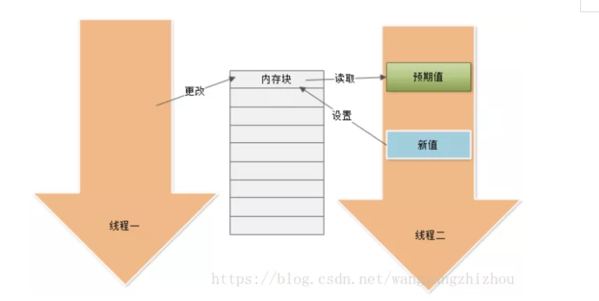
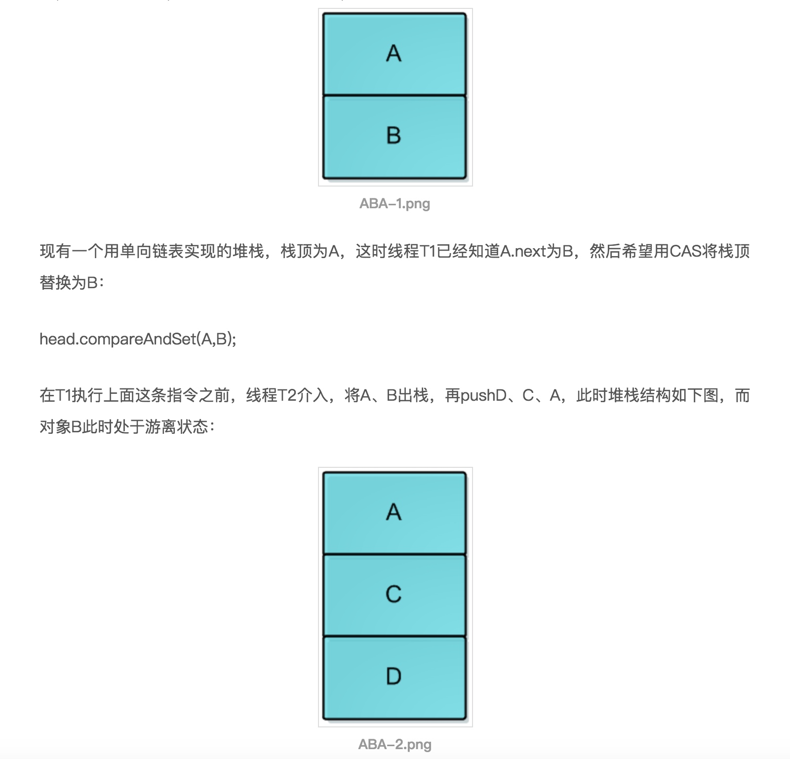
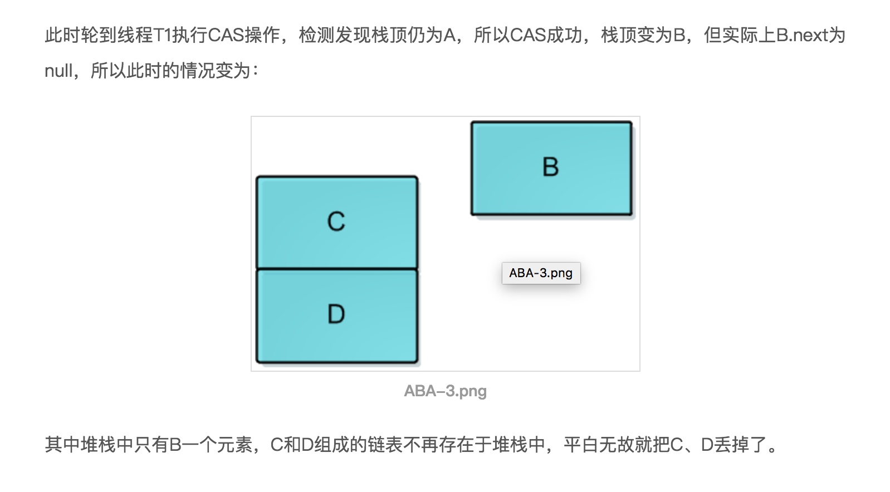

# 锁
* 加锁的意义不仅在与互斥行为，还包括内存的可见性。为了确保所有线程都能看到共享变量的最新值，所有执行读操作或者写操作的线程都必须在同一个锁上同步

# 悲观锁
互斥锁是最常见的同步手段，在并发过程中，当多条线程对同一个共享数据竞争时，它保证共享数据同一时刻只能被一条线程使用，其他线程只有等到锁释放后才能重新进行竞争

* synchronized 加锁的粒度随意，可以在变量、方法、对象、类上面加锁。
    * synchronized修饰的代码块编译后，前后会增加onitorenter和monitorexit字节码指令。
    * 当一个对象synchronized修饰，里面所有synchronized修饰的方法都将被堵塞，未被synchronized修饰的方式，可以正常执行。
    * JVM的monitorenter和monitorexit字节码依赖底层操作系统的互斥锁来实，java层面的线程与操作系统的原生线程有映射关系，这时候讲一个线程堵塞或者唤起都是需要依赖于操作系统去处理，此处就需要从用户态切换到内核态来执行，这种切换的成本较高，频繁的切换会消耗大量CPU的时间。所以为了减少这样的切换，JVM做了优化，此时怀让线程自旋等待一会，可能一会，别的线程就释放了锁。
    * 自旋： 某一线程去尝试获取某个锁时，如果该锁已经被其他线程占用的话，此线程将不断循环检查该锁是否被释放，而不是让此线程挂起或睡眠。它属于为了保证共享资源而提出的一种锁机制，与互斥锁类似，保证了公共资源在任意时刻最多只能由一条线程获取使用，不同的是互斥锁在获取锁失败后将进入睡眠或阻塞状态
        * 仅适用于占用时间短、颗粒度很小的情景
        * 需要硬件级别的原子操作。
        * 它无法保证公平性。
        * 每次读写操作需要同步每个处理器的缓存

# 乐观锁
* 核心算法： CAS(compare and swap)自旋，涉及三个操作数：内存值，期望值，新值。内存值和期望值相同，则认为该内存值没有被别的线程在使用，就把内存值更新为新值。

* 比较和设置应该要保持原子性，要不然就无法再并发下使用了。此处比较和设置的原子性是由cpu的硬件指令去实现了，java中是由c++的native方法去实现的。
* ABA问题
CAS的核心思想是通过比对内存值与预期值是否一样而判断内存值是否被改过，但这个判断逻辑不严谨，假如内存值原来是A，后来被一条线程改为B，最后又被改成了A，则CAS认为此内存值并没有发生改变，但实际上是有被其他线程改过的，这种情况对依赖过程值的情景的运算结果影响很大。
    * 举例说明：
    
    

    * 解决方案：增加版本号，记录中间变化的过程。

* 缺点：
    * 只能针对一个共享变量加锁，锁的粒度较小。 