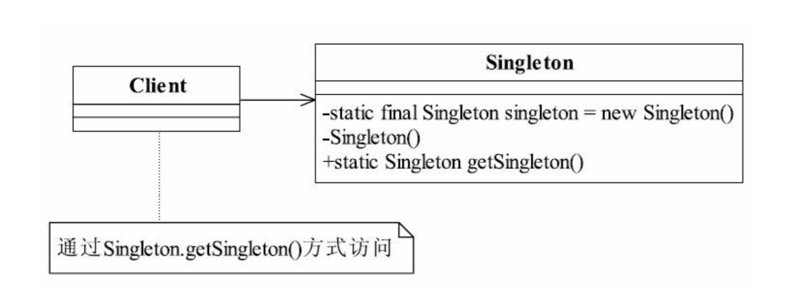

# 单例模式

确保某天一个类只有一个实例，而且自行实例化并向整个系统提供这个实例

### UML图


### 优缺点

####优点
* **减少内存开支** ：单例模式内存中只有一个实例，减少内存开支，特别是一个对象需要频繁地创建、销毁时，而且创建或销毁性能又无法优化，单例模式的优势就非常明显了
* **减少系统性能开销**：若对象产生需要比较多资源时，比如读取配置、产生其他依赖对象时，使用单例，仅生成一个单例独享，会减少系统性能开销

####缺点
* 不易扩展


## 实现方式
### 饿汉式
```java
/**
* 线程安全，并发性能良好，不可延迟加载
* 若单例创建依赖于参数或者配置文件的时候，将无法使用
*/
public class Singleton{
    //类加载时就初始化
    private static final Singleton instance = new Singleton();
    
    private Singleton(){}

    public static Singleton getInstance(){
        return instance;
    }
}
```
### 懒汉式
* 线程不安全

```java
/**
* 线程不安全，多线程环境下，可能产生多个实例
*/
public class Singleton {
    private static Singleton instance;
    private Singleton (){}

    public static Singleton getInstance() {
     if (instance == null) {
         instance = new Singleton();
     }
     return instance;
    }
}
```

* 线程安全
    * 方法加锁

    ```java
    /**
    * 线程安全+延迟加载+并发效率不高
    *
    * 任何时候，仅有一个线程可以调用getInstance方法，但是其实同步操作只需要第一次调用的时候才需要
    */
    public class Singleton {
        private static Singleton instance;
        private Singleton (){}
        
        public static synchronized Singleton getInstance(){
            if (instance == null) {
                instance = new Singleton();
            }
            return instance;
        }
    
    }

    ```
    * DCL(double check locking pattern) 双重校验锁模式

    ```java
    /**
    * 线程安全+延迟加载+并发效率高
    * 解决了懒汉方法加锁实现方式的缺陷
    */
    public class Singleton {
        private static Singleton instance;
        private Singleton (){}
        
        public static synchronized getInstance(){
            if(instance == null){
                sychronized(Singleton.class){
                    if(instance == null){
                        instance = new Singleton();
                    }
                }
            }
            return instance;
        }
    
    }

    ```
    
    **instance = new Singleton()**,不是原子操作，可能会引起进行指令重排序，导致返回空引用的问题。
    以上语句在jvm中可以分为如下3个原子流程：
    ```
    1. 给instance 分配内存
    2. 调用 Singleton 的构造函数来初始化成员变量
    3. 将instance对象指向分配的内存空间（执行完这步 instance 就为非 null 了
    ```
    此时为了防止指令重排序，将instance变量声明为volatile即可，最终代码如下:
    ```java
    public class Singleton {
        private volatile static Singleton instance; //声明成 volatile
        private Singleton (){}
        public static Singleton getSingleton() {
            if (instance == null) {                         
                synchronized (Singleton.class) {
                    if (instance == null) {       
                        instance = new Singleton();
                    }
                }
            }
            return instance;
        }
   
    }
    ```
    
### 静态内部类
```java
public class Singleton {  
    private static class SingletonHolder {  
        private static final Singleton INSTANCE = new Singleton();  
    }  
    private Singleton (){}  
    public static final Singleton getInstance() {  
        return SingletonHolder.INSTANCE; 
    }  
}
```

### 枚举 Enum
```java
    public enum Singleton{
        INSTANCE;
    }
```

## 实现方式比较
|实现方式|线程安全|并发性能好|可延迟加载|序列化/反序列化安全|
|:--:|:--:|:--:|:---:|:---:|
|饿汉式|✔️|✔️|||
|懒汉式-方法加锁|✔️||✔️||
|DCL|✔️|✔️|✔️||
|静态内部类|✔️|✔️|✔️||
|枚举|✔️|✔️||✔️|

    