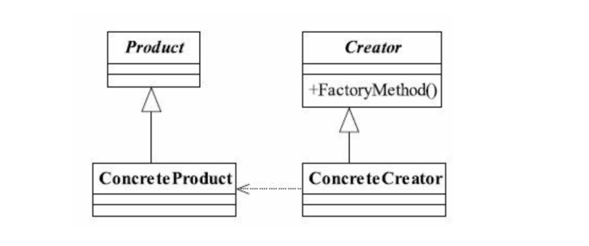
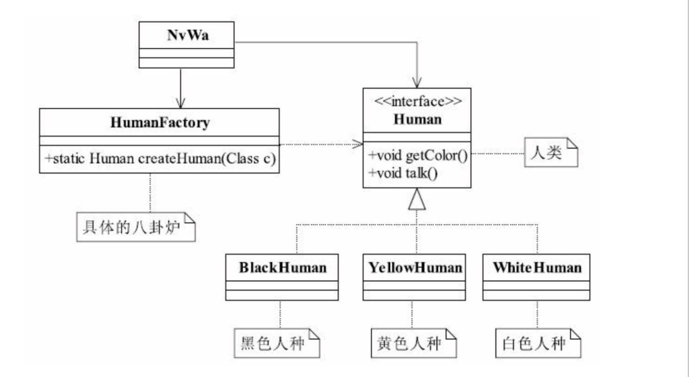
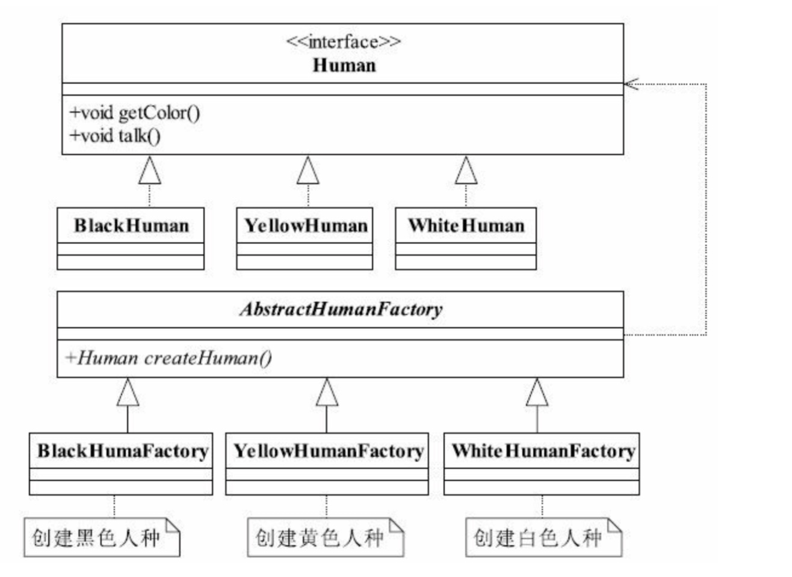

# 工厂方法模式

> 定义一个用于创建对象的接口，让子类决定实例化哪一个类。工厂方法使一个类的实例化延迟到其子类。

## UML图



* product为抽象的产品类，定义产品的共性
* creator为抽象的工厂类，具体如何创建产品延迟至其子类去实现。

```java
    public abstract class Product{
        //产品类的公共方法
        public void method(){
            //业务处理逻辑
        }
        
        public abstract void method2();
    }
    
    public class ConcreteProduct extends product{
        public void method2(){
        
        }
    }
    
    public abstract class Creator{
        public abstract <T extends Product> T createProduct(Class<T> c);
    }
    
    public class ConcreteCreator extends Creator{
      public abstract <T extends Product> T createProduct(Class<T> c{
        Product product = null;
        try{
            product = (Product)Class.forName(c.getName()).newInstance();
        }catch(Exception e){
            //异常处理
        }
        return (T)product;
      }

    }
    
    public class Client{
        Creator creator = new ConcreteCreator();
        Product product = creator.createProduct(ConcreteProduct1.class);
        //继续业务处理
    }
    
```

## 应用
### 优点
* 扩展性挺好：在增加产品类的情况下，只需要适当修改工厂类或者扩展一个工厂类。对于上层使用者来说，没有变化。
* 解耦框架：上层模块只需要依赖产品抽象类，无需关系实现类细节，新增产品，只需要扩展工厂类或者修改工厂类即可，上层模块无需变化。符合迪米特法则：无需我关心的就不需要去关心。也符合依赖倒置原则：只依赖产品的抽象类，也符合里氏替换原则：使用产品的子类替换产品父类。
* 实际例子： JDBC连接数据库，数据库从mysql切换至Orcle，需要改动的地方就是切换一个驱动名称，其他无需修改。


### 扩展
#### 简单工厂模式（静态工厂模式）
* 只需要一个工厂类，直接将生产方法定义为静态方法



#### 多个工厂类

* 当对象类繁多，且对象类的初始化过程各不相同，且复杂，可以实现多个不同的工厂类


* 带来的问题：可扩展性和可维护性带来一定影响，如果需要扩展一个产品类，则需要相应建立一个工厂类。

### 替换单例模式


