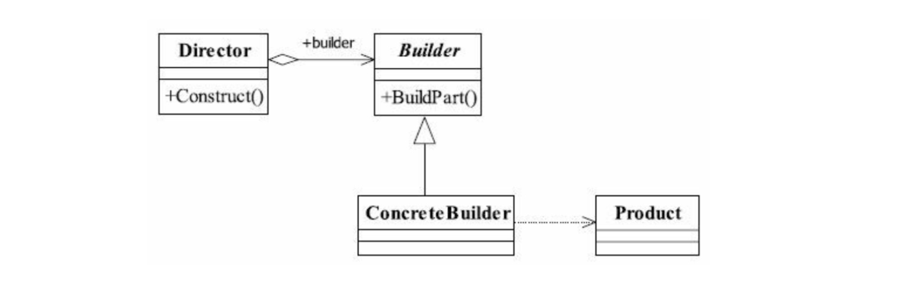

# 建造者模式

> 将一个复杂对象的构建与它的表示分离，使得同样的构建过程可以创建不同的表示。

## UML

* Product产品类
* Builder抽象建造者
规范产品的组建，一般由子类实现。
* ConcreteBuilder
实现抽象类定义的所有方法，并且返回一个组建好的对象。
* Director
    * 负责安排已有模块的顺序，然后告诉Builder开始建造。

## 应用
* 优点
    * 封装性
    * 建造者独立，容易扩展
    * 便于控制细节风险
* 使用场景
    * 相同的方法，不同的执行顺序，产生不同的事件结果时，可以采用建造者模式。
    * 多个部件或者零件，都可以装配到一个对象中，但是产生的运行结果由不相同时，则可以使用该模式。
    * 产品类非常复杂，或者产品类中的调用顺序不同产生不同的效能。
* **建造者模式关注的是零件类型和装配工艺(顺序)，这是它与工厂方法模式最大不同的地方，虽然同为创建者模式，但是注重点不同**