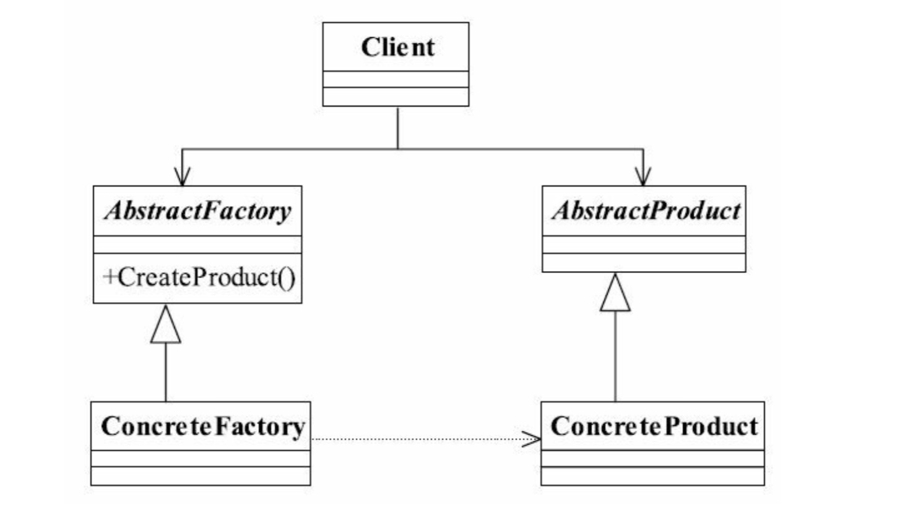
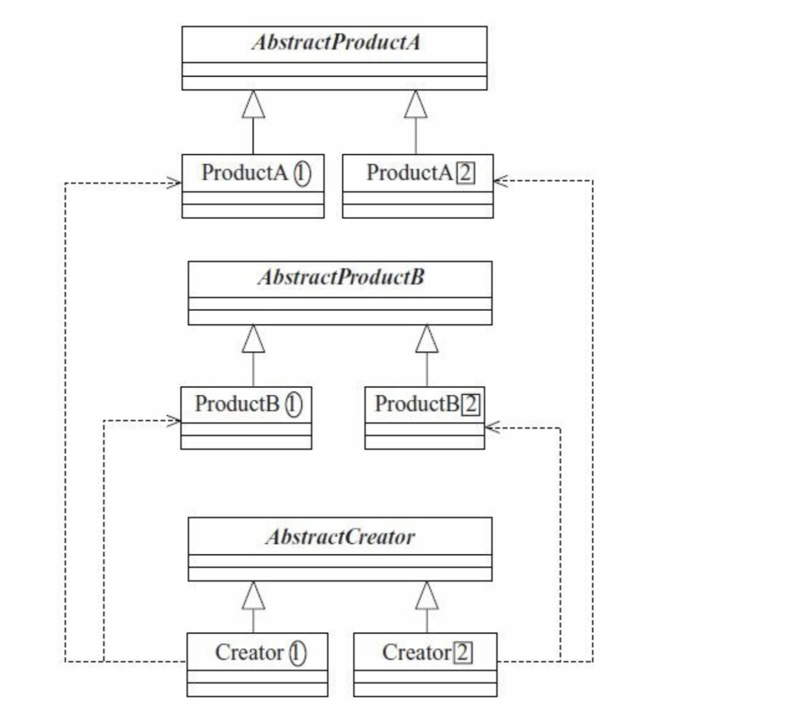

# 抽象工厂模式

> 为创建一组相关或相互依赖的对象提供一个接口，而且无须指定它们具体的实现类

## UML图

* 工厂方法模式的升级版本，关键点在于：多个业务品种，业务分类。

## 优缺点
* 优点
    * 封装性
    * 产品族内的约束为非公开状态。
* 缺点
    * 横向扩展简单：例如对于上图，需要增加一个产品等级为3的生产类，只需要增加了Creator【3】即可，符合开闭原则的。
    * 纵向扩展比较难：如增加一个产品C，产品家族有2编程3，改动较大。AbstractCreator要增加一个方法createProductC,两个已有的实现类Createor[1] Createor[2]都需要修改。

## 使用场景

一个对象族(或是一组没有任何关系的对象) 都有相同的约束，则可以使用抽象工厂模式。例如：一个文本编辑器和一个图片处理器，都是软件实体，但是在linux下的文本编辑器和windows的文本编辑器虽然功能和界面相同，但是代码实现不同，图片处理器也有类似情况。也就是文本编辑器和图片处理器有了共同的约束条件，操作系统类型。此时就可以使用抽象工厂模式。

