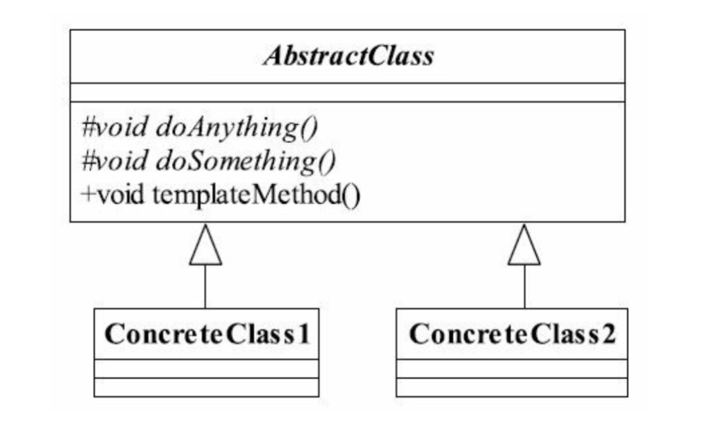

# 模板方法模式

> 定义一个操作中的算法的框架，而将一些步骤延迟到子类中实现。使得子类可以不改变一个算法的结构即可重定义该算法的某些特定步骤。

## UML图

* 基本方法：由子类实现，并且在模板方法中调用
* 模板方法：可以有一个或者几个，一般是一个具体的方法，也就是一个框架，实现对基本方法的调度，完成固定的逻辑。
*  ** 为了防止恶意操作，一般模板方法都加上final关键字，不允许被覆写**
*  ** 抽象模板中的基本方法尽量设计为protected类型，符合迪米特法则，不需要暴露的属性或方法尽量不要设置为protected类型。实现类若不需要，尽量不要扩大父类方法的访问权限**

## 应用
* 优点
    * 封装不变部分，扩展可变部分
    * 提取公共部分代码，便于维护
    * 行为由父类控制，子类实现
* 使用场景
    * 多个子类有公有的方法，并且逻辑基本相同。
    * 重要、复杂的算法，可以把核心算法设计为模板方法，周边的相关细节功能则由各个子类实现。
    * 重构时，模板方法模式是一个经常使用的模式，把相同的代码抽取到父类中，然后通过钩子函数约束其行为。
        * 抽象类定义一个方法，该方法会影响模板方法的执行流程/执行结果，由具体子类去实现，来控制模板方法的执行流程，这个方法就是钩子方法

    
    