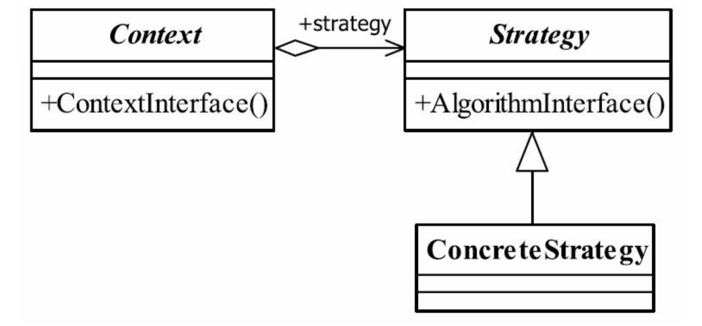

# 策略模式

> 定义一组算法，将每个算法都封装起来，并且使它们之间可以互换

## UML

* context封装角色，屏蔽高层模块对策略、算法的直接访问。
* 策略模式其实就是一个多态的实现。

## 应用
* 优点
    * 算法可以自由切换，多态保证
    * 避免使用多重条件判断
    * 扩展性良好
* 缺点
    * 策略数量多
    * 所有的策略类都需要对外暴露
* 应用场景
    * 多个类只有在算法或行为上稍有不同的场景
    * 算法需要自由切换的场景
    * 需要屏蔽算法规则的场景
    
* 注意事项
    * 若策略数量增大到一定量级，需要考虑使用混合模式
* 扩展
    * 策略枚举