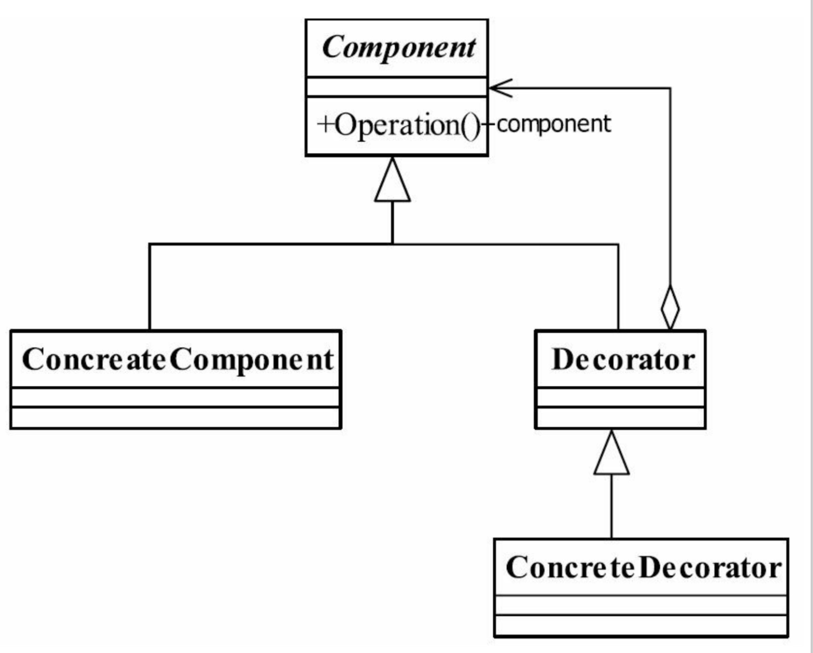

# 装饰模式

> 动态地给一个对象增加一些额外的职责。就增加功能来说，装饰模式相比生成子类更为灵活。

## UML

* component抽象构件
    * 接口或者抽象类，最原始的对象
    * **装饰模式中，必然有个最基本、最核心、最原始的接口或抽象类充当Component抽象构件**
* ConcreteComponent具体构件
    * 被装饰的对象
* Decorator装饰角色
    * 既继承抽象构件，又拥有抽象构件的引用。
* ConcreteDecorator具体的装饰对象

* **装饰是可以叠加的，可以多层装饰**

## 应用
* 优点
    * 装饰类和被装饰类是可以独立发展，不会相互耦合。
    * 装饰模式是继承关系的一个替代方案。
    * 装饰模式动态地扩展一个实现类的功能
    * 扩展性很好
* 缺点
    * 多层装饰是比较复杂的
* 应用场景
    * 扩展一个类的功能，或增加附加功能
    * 动态给一个对象增加功能，这些功能可以再动态地撤销
    * 需要为一批兄弟类进行改装或加装功能，首选装饰模式。

* 装饰模式可以替代继承，解决类膨胀的问题。继承是静态地给类增加功能，装饰模式则是动态地增加功能。