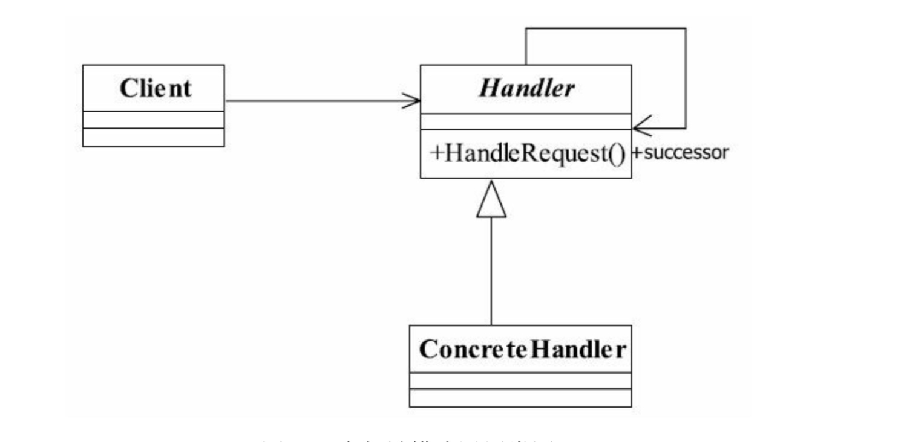

# 责任链模式
 > 使多个对象都有机会处理请求，从而避免了请求的发送者和接受者之间的耦合关系。将这些对象连成一条链，并沿着这条链传递该请求，直到有对象处理它为止。
 
 
## UML


```java
public abstract class Handler{
  private Handler nextHandler;
  
  public final Response handleMessage(Request request){
    Response response = null;
    if(this.getHandleLevel().equals(request.getRequestLevel())){
      response = this.echo(request);
    }else{
      if(this.nextHandler != null){
        response = this.nextHandler.handlerMessage(request);
      }else{
      
      }
    }
    return response;
  }
  
  public void setNext(Handler handler){
    this.nextHandler = handler;
  }
  
  protected abstract Level getHandlerLevel();
  
  protected abstract Response echo(Request request);
}
```

* 以上融合了模板方法模式，各个实现类只要关注自己的业务逻辑就可以了，至于说什么事要自己处理，那就让父类去决定，父类起到了请求传递的功能，子类实现了请求的处理。
 