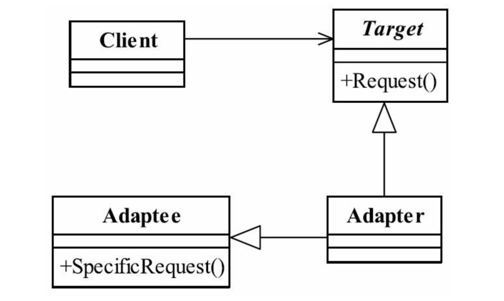

# 适配器模式

> 将一个类的接口变换成客户端所期待的另一种接口，从而使原本因接口不匹配而无法在一起工作的两个类能够在一起工作

## UML

* adaptee 源角色
* adapter 适配器角色
* Target 目标角色，该角色定义把其他类转化为何种接口，也就是我们期望的接口

## 应用
* 优点
    * 可以让两个没有任何关系的类在一起运行。
    * 增加类的透明性
        * 我们想访问的是target目标角色，但是具体的实现委托给了源角色，对于高层模块来说，此处是透明的。
    * 提高了类的复用度
    * 灵活性非常好
* 使用场景
    * 修改一个已经投产使用的接口时
* 注意事项
    * 适配器模式是一个补偿性质的模式，是去扩展或者修改已投入使用的接口而服务的。
    * 初期的设计阶段不应该考虑 