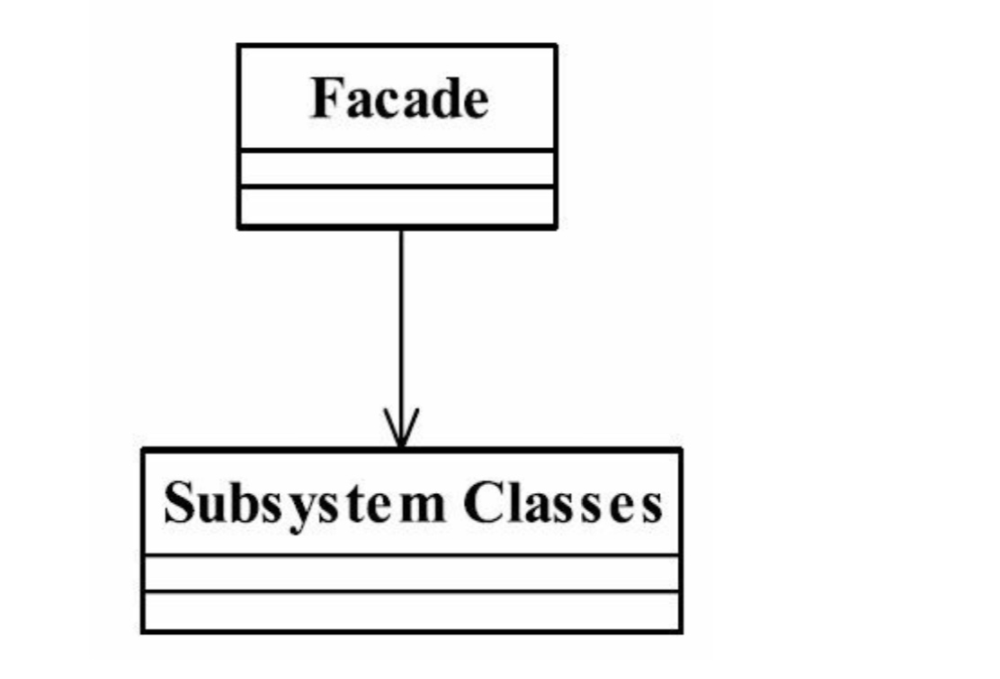

# 门面模式（外观模式）

> 要求一个子系统的外部与其内部的通信必须通过一个统一的对象进行，门面模式提供一个高层次的接口，使得子系统更易于被使用。

## UML

* 门面模式注重“统一的对象”，也就是提供一个访问子系统的接口，除了这个接口不允许有任何访问子系统的行为发生。

## 应用
* 优点
    * 减少系统的相互依赖
    * 提高了灵活性
    * 提高安全性
* 缺点
    * 不符合开闭原则，出现问题，必须修改门面代码
* 使用场景
    * 为一个复杂的模块或子系统提供一个供外接访问的接口
    * 子系统相对独立-外接对子系统的访问只要黑箱操作即可。
    * 预防低水平人员带来的风险扩散