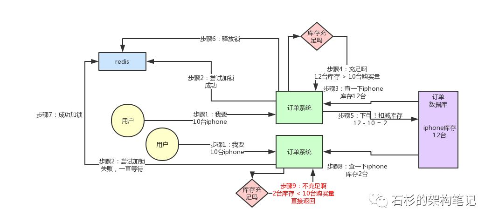

# redis对象模型
* simple dynamic string(简单动态字符串)
* 链表
* 字典
* 跳跃表
* 整数集合
* 压缩列表
* 对象

# redis持久化
* RDB持久化
    * 数据结构数据化存储
* AOF持久化
    * 数据修改命令append形式
* redis过期键删除策略
    * 定时删除
      在设置键的过期时间的同时，创建一个定时器（timer），让定时器在 键的过期时间来临时，立即执行对键的删除操作。
    * 惰性删除
      放任键的过期不管，单是每次从键控件中获取键时，检查取得的键是否过期，如果过期的话，就删除该键；如果没有过期，就返回该键。
      * 优点：CPU友好，只在非做不可的情况下去删除键，并且仅删除目标键，不会浪费CPU时间去删除其他的键。
      * 缺点：如果有大量过期健，且长时间不存在读取操作，会占用大量内存。
    * 定期删除
      每隔一段时间，对键空间进行一次检查，删除里面的过期键，需要合理设置执行频率和执行时长。
     
     * **redis的过期键删除策略**
         * 惰性删除和定期删除两种策略配合使用。
         * 惰性删除：查询时检查key是否存在，过期了就删除，未过期则返回
         * 定期删除：定期执行，从redis数据库中随机取出一定数量的键进行检查，并且删除其中的过期键。
    
# redis事件驱动模型(reactor模式)
* 单线程,执行快
    * 绝大多数的请求是内存操作，所以很快
    * 单线程，避免了多线程带来的上下文切换，竞争条件
    * 非阻塞IO（epoll）

* IO模型
    * 阻塞IO(blocking IO)
        
    * 非阻塞IO(nonblocking IO)
        
        * 数据未准备好时，进程将立即得到结果
        * 进程会轮询操作系统数据是否准备好
    * IO多路复用(IO multiplexing)，事件驱动IO
        
        
        * 一个进程可以同时处理多个IO事件
        * 实现机制
            * select
                * 流程
                    1. process调用select，返回监听的N个socket是否有IO就绪的
                    2. 存在的话，就遍历监听的socket数组，获取准备就绪的socket
                    3. 返回响应的socket事件给到process
                * 缺点：
                    * 监控的socket最多只能是1024个
                    * 得到有IO事件就绪，需要遍历监控的socket集合
            * poll
                * 流程
                    1. 监听的fd使用链表保存，所以大小无限制
                    2. 其余的流程和select一样
                * 优点:
                    * 解决了select fd最大为1024的问题
                * 缺点
                    * 同select
            * epoll
                * 调用epoll_wait直接返回准备就绪的IO事件，无需遍历监听的所有的IO事件，完美解决了select/poll存在的问题
                * 具体的原因
                    * fd以红黑树存储在内核cache中
                    * 存在一个list链表存储IO事件准备就绪的fd
                    * 存储IO事件准备就绪的fd的实现方式，是通过内核在IO事件准备就绪的时候，执行回调函数，直接将fd维护到链表中
    * 异步IO
        


# redis集群
* 主从复制
* 哨兵(高可用)
* 集群(分布式存储)

# redis事务
* 原子性
    * 一个操作的不可以再分，操作要么执行，要么不执行
    * redis是单线程，命令都是one-by-one执行的，所以redis提供的api命令都是原子性的。
    * 实际使用过程的，我们可能会是多个命令一起使用，这样就无法保证原子性，此时所述的原子性应该指的是这些批量操作的原子性，可以使用redis事务，redis+lua的形式进行实现。

    
# redis 发布订阅

# lua
* reids 2.6.0 版本开始支持lua脚本
* 支持lua脚本的优点
    * **原子性的操作**：Redis会将整个脚本作为一个整体执行，中间不会被其他命令插入。因此在编写脚本的过程中无需担心会出现竞态条件，无需使用事务。
    * **减少网络开销**：可以将多个请求通过脚本的形式一次发送，减少网络时延和请求次数
    * **代码复用**：客户端发送的脚步会永久存在redis中，这样，其他客户端以 复用这一脚本来完成相同的逻辑 
* script load，加载脚本，返回一个sha1算法计算的值
* evalsha sha1Str 执行对应的lua脚本
* script kill
    * 利用lua脚本引擎的钩子函数，lua引擎每执行1w条指令，执行一次钩子函数

# 分布式锁
实现分布式锁要满足如下几个特性：
* 互斥性：在任意时刻，只有一个客户端能持有锁。
* 不会发生死锁：即使有一个客户端在持有锁的期间崩溃而没有主动解锁，也能保证后续其他客户端能加锁。
* 具有容错性。只要大部分的Redis节点正常运行，客户端就可以加锁和解锁。
* 加锁和解锁必须是同一个客户端，客户端自己不能把别人加的锁给解。


### setnx()、expire()方法实现分布式锁
```java
public static void wrongGetLock1(Jedis jedis, String lockKey, String requestId, int expireTime) {
 
    Long result = jedis.setnx(lockKey, requestId);
    if (result == 1) {
        // 若在这里程序突然崩溃，则无法设置过期时间，将发生死锁
        jedis.expire(lockKey, expireTime);
    }
}
```
setNX、expire单个命令是原子性，但是组合使用，并不是原子性，若在setNx后程序崩溃，导致过期时间未设置，将发生死锁现象。

### setNx
```java
public static boolean wrongGetLock2(Jedis jedis, String lockKey, int expireTime) {
 
    long expires = System.currentTimeMillis() + expireTime;
    String expiresStr = String.valueOf(expires);
 
    // 如果当前锁不存在，返回加锁成功
    if (jedis.setnx(lockKey, expiresStr) == 1) {
        return true;
    }
 
    // 如果锁存在，获取锁的过期时间
    String currentValueStr = jedis.get(lockKey);
    if (currentValueStr != null && Long.parseLong(currentValueStr) < System.currentTimeMillis()) {
        // 锁已过期，获取上一个锁的过期时间，并设置现在锁的过期时间
        String oldValueStr = jedis.getSet(lockKey, expiresStr);
        if (oldValueStr != null && oldValueStr.equals(currentValueStr)) {
            // 考虑多线程并发的情况，只有一个线程的设置值和当前值相同，它才有权利加锁
            return true;
        }
    }
 
    // 其他情况，一律返回加锁失败
    return false;
 
}
```
存在如下问题:
* 过期时间是由客户端生成的，所以各个客户端的时钟必须是同步统一的。
* 当锁过期，若多个客户端同时执行到了getSet方法，虽然最终只有一个客户端可以加锁，则锁的过期时间可能被其他客户端覆盖。
* 锁没有客户端标识，可以解除别人的锁。

### lua脚本保证原子性，redisson分布式锁原理


* lock lua脚本

    ```lua
    if (redis.call('exists', KEYS[1]) == 0) then 
        redis.call('hset', KEYS[1], ARGV[2], 1); 
        redis.call('pexpire', KEYS[1], ARGV[1]); 
        return nil; 
    end; 
    -- 可重入锁的实现
    if (redis.call('hexists', KEYS[1], ARGV[2]) == 1) then 
        redis.call('hincrby', KEYS[1], ARGV[2], 1); 
        redis.call('pexpire', KEYS[1], ARGV[1]); 
        return nil; 
    end; 
    return redis.call('pttl', KEYS[1]);
    ```
    
    redisson java部分代码
    
    ```java
    <T> RFuture<T> tryLockInnerAsync(long leaseTime, TimeUnit unit, long threadId, RedisStrictCommand<T> command) {
        this.internalLockLeaseTime = unit.toMillis(leaseTime);
        return this.commandExecutor.evalWriteAsync(this.getName(), LongCodec.INSTANCE, command, "if (redis.call(\'exists\', KEYS[1]) == 0) then redis.call(\'hset\', KEYS[1], ARGV[2], 1); redis.call(\'pexpire\', KEYS[1], ARGV[1]); return nil; end; if (redis.call(\'hexists\', KEYS[1], ARGV[2]) == 1) then redis.call(\'hincrby\', KEYS[1], ARGV[2], 1); redis.call(\'pexpire\', KEYS[1], ARGV[1]); return nil; end; return redis.call(\'pttl\', KEYS[1]);", Collections.singletonList(this.getName()), new Object[]{Long.valueOf(this.internalLockLeaseTime), this.getLockName(threadId)});
    }
    ```
    
 lock之后的redis中实际存储的数据结构为：
 ```json
 {
 "myLock":{
        "346e1eb8-5bfd-4d49-9870-042df402f248":1
    }
 }
 ```
 存储的是一个map结构，map中key是当前获得到该锁的客户端标识，value是获取锁的次数，也就是实现了可重入锁。
  
* unlock lua脚本

    ```lua
    if (redis.call('exists', KEYS[1]) == 0) then
        redis.call('publish', KEYS[2], ARGV[1]);
        return 1; 
    end;
    if (redis.call('hexists', KEYS[1], ARGV[3]) == 0) then 
        return nil;
    end; 
    local counter = redis.call('hincrby', KEYS[1], ARGV[3], -1); 
    if (counter > 0) then 
        redis.call('pexpire', KEYS[1], ARGV[2]); 
        return 0; 
    else 
        redis.call('del', KEYS[1]); 
        redis.call('publish', KEYS[2], ARGV[1]); return 1; 
    end; 
    return nil;
    ```
    1. 如果lock键不存在，发消息说锁已经可用
    2. 如果锁不是被当前线程锁定，则返回nil
    3. 由于支持可重入，在解锁时将重入次数需要减1
    4. 如果计算后的重入次数>0，则重新设置过期时间
    5. 如果计算后的重入次数<=0，则发消息说锁已经可用

* 优点
    * redisson实现了java标准lock接口，使用起来简便
* 缺点
    * redis master-slave复制延迟的问题，导致重复lock。例如，A将lock写入master,此时master宕机，重新选取slave来当master，此时slave中午lock，则B也可以进行lock，那么此时A，B都会或得到锁，在可能产生脏数据。
    * 为了解决redis 的master-slave模式带来的问题，可以使用redisson的redlock算法的实现形式。
    * redLock算法
        * 解决集群问题
        * 加锁/解锁要在集群中大多数机器都加锁成功，才认为是成功
        * 大多是机器都有锁的数据，所以master-slave存在的问题

# 分布式锁高并发的问题
加入了分布式锁，必然会带来一个并发性能的问题。

解决此问题可以从如下考虑：
1. 临界资源的控制，要明确，要细化，即在代码中，被lock.lock()和lock.unlock()包裹住的代码块，需要尽可能明确，是需要对什么进行控制。过大，自然会影响并发性能
2. 可以仿照java7，8中针对ConcurrentHashMap中实现思路，进行分段枷锁，意思就是将需要枷锁的临界资源进行分段，对每个分段一次加锁。举个利用分布式锁，实现防超卖的例子：
    * 未分段加锁
    
    
    此处，一个个的请求是one-by-one进行，在并发量很大的情况下，会导致系统吞吐量不够。

    * 分段加锁
 
 

 提高了并发量，但代码实现起来较为复杂。 
 
# 缓存的常见问题
https://www.jianshu.com/p/ea4fa7ca4fd4
 
## 缓存不一致问题
 
## 缓存穿透问题
* 概念： 在高并发场景下，如果某一个key被高并发访问，没有被命中，出于对容错性考虑，会尝试去从后端数据库中获取，从而导致了大量请求达到数据库，而当该key对应的数据本身就是空的情况下，这就导致数据库中并发的去执行了很多不必要的查询操作，从而导致巨大冲击和压力
* 解决方案：
    * 缓存空对象
    * 编码层过滤

## 缓存颠簸问题（缓存抖动）
* 概念：
* 解决方案
 * 一致性hash算法
 
## 缓存雪崩
* 概念：由于缓存的原因，导致大量请求到达后端数据库，从而导致数据库崩溃，整个系统崩溃，发生灾难

## 缓存无底洞现象
 
## 缓存并发竞争
 


