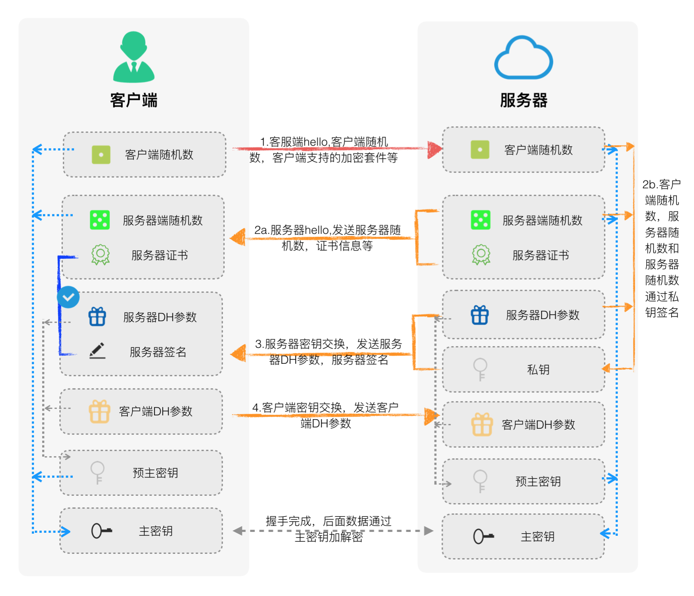

# https

## http存在的问题
(1) 窃听风险（eavesdropping）：第三方可获知通信内容。
(2) 篡改风险（tampering）：第三方可以修改通信内容。
(3) 冒充风险（pretending）：第三方可以冒充他人进行通信

## 使用对称加密进行加密
* 加密秘钥如何传输？加密秘钥明文传输就没有意义了。

## 引入非对称加密来加密 对称加密的秘钥

**这样存在一个问题，公钥仍然是明文传输的，中间人攻击，仍然可以拦截到服务器下发的公钥，然后伪造一个自己公钥发给客户端，这样就可以实现内容拦截和篡改了**，图解示例如下:

**这其中一个中间问题就是：通信双方都是无法判断对方的身份的，导致无法使这个过程是可信的**

## 引入中间权威机构，进而判断通信双方的身份

* 服务器先将自己生成的证书发送给CA(证书的权威机构)
* CA会对证书的内容进行hash运算，然后用CA自己的私钥对hash运算的结果进行加密，即数字签名
* 然后服务端将这个签名了之后的证书发送给客户端。
* 客户端本地电脑系统已预先安装了很多权威的证书签发中心，找到对应的证书中心，获得对应中心的公钥，即可解密服务端传递过来的证书，得到对应的服务器公钥、域名和哈希值。
    * 根据哈希值可以判断内容是否被修改过。
    * 根据域名是否相同可以判断正式是否被中间人劫持。
* **1-8步均是为了保证通信双方的身份安全，为了获取到服务器端公钥**。

## http握手过程

### 1.Client Hello过程

这一步向服务器发送的一下信息：
    * 支持的协议版本，如TLS 1.0版本
    * 一个客户端生成的随机数，稍后用于生成"会话秘钥"
    * 支持的加密算法，如RSA公钥加密
    * 支持的压缩方法
    
**需要注意的点**：需要注意的是，客户端发送的信息之中不包括服务器的域名。即理论上服务器只能包含一个网站，否则会分不清应该向客户端提供哪一个网站的数字证书。这就是为什么通常一台服务器只能有一张数字证书的原因。
    
但是，这对于虚拟主机用户来说，极为不便。为此，2006年，TLS协议加入了一个[Server Name Indication扩展](https://tools.ietf.org/html/rfc4366)，允许客户端向服务器提供它所请求的域名。

### 2.Server Hello过程

服务器向客户端发送的内容如下：
    * 确认使用的加密通信协议版本，比如TLS 1.0版本。如果浏览器与服务器支持的版本不一致，服务器关闭加密通信
    * 一个服务器生成的随机数，稍后用于生成”会话密钥”
    * 确认使用的加密方法，如RSA公钥加密
    * 服务器证书

**注意**: 除了以上信息，如果服务器需要确认客户端的身份，就会再包含一项请求，要求客户端提供”客户端证书”。比如，金融机构往往只允许客户连入自己的网络，就会向正式客户提供USB密钥，里面就包含了一张客户端证书    

### 3.客户端回应

在回应之前，首先验证证书的合法性，主要验证如下几个方面：
    1. 证书是否是可信任机构颁发
    2. 证书中的域名和实际域名是否一致
    3. 证书是否已经过期
    
如果证书没有问题，就用CA秘钥解密证书中的公钥。向服务器发送如下信息：

   * 一个随机数(premaster secret)。该随机数用服务器公钥加密，防止被窃听
   * 编码改变通知，表示随后的信息都将用双方商定的加密方法和密钥发送
   * 客户端握手结束通知，表示客户端的握手阶段已经结束。本项的值为前面发送的所有内容的hash值，用于服务器校验，以防被篡改  

### 4.服务器回应

服务器获取到premaster secret后，使用私钥解密，然后结合1和2中生成的随机数，计算出最终用于加密http报文的秘钥(session secret)

向客户端发送如下信息:

* 编码改变通知，表示随后的信息都将用双方商定的加密方法和密钥发送。
* 服务器握手结束通知，表示服务器的握手阶段已经结束。本项的值为前面发送的所有内容的hash值，用于服务器校验，以防被篡改。

### 为什么需要用三个随机数

> 不管是客户端还是服务器，都需要随机数，这样生成的密钥才不会每次都一样。由于SSL协议中证书是静态的，因此十分有必要引入随机因素来保证协商出来的密钥的随机性。
对于RSA密钥交换算法来说，premaster secret本身就是一个随机数，再加上hello消息中的随机数，三个随机数通过一个密钥导出器最终导出一个对称密钥。
Premaster secret的存在在于SSL协议不信任每个主机都能产生完全随机的随机数，如果随机数不随机，那么premaster secret就有可能被才出来，那么仅适用premaster secret作为密钥就不合适了，因此必须引入新的随机因素，那么客户端和服务器加上premaster secret三个随机数一同生成的密钥就不容易被猜出了，一个伪随机数可能完全不随机，可是三个伪随机数就十分接近随机了

### 数字证书

数字证书由证书中心(Certificate authority，简称CA)颁发。证书中心用自己的私钥，将服务器的公钥及其相关信息进行加密，生成”数字证书“(Digital Certificate)

### 数字签名

数字签名就是使用私钥加密，公钥解密。用于验证内容是否被篡改。

对通信过程的内容，进行hash运算，hash的值称之为通信内容的摘要（digest）。
然后，使用私钥将摘要进行加密，得到数字签名（Signature）。而接收端使用公钥即可解密得到摘要。

最后客户端将通信内容进行hash运算与解密后服务器端的摘要进行对比，就可以判断内容是否被篡改了。

### 基于DH算法进行https握手

上述随机数生成秘钥的形式的安全性，取决于第三个随机数的安全性。

DH秘钥的交换过程：
1. 一方选择质数p=23和基数g=5发送给另一方，这两个数可以公开明文传输；
2. 甲方生成私钥a=6，并计算公钥A = ga mod p = 56 mod 23 = 8；
3. 乙方生成私钥b=15，并计算公钥B = gb mod p = 515 mod 23 = 19；
4. 甲乙双方互换公钥；
5. 甲方计算s = Ba mod p = 196 mod 23 = 2；
6. 乙方计算s = Ab mod p = 815 mod 23 = 2；
最后双方的共同计算结果2就是接下来进行对称加密传输的密钥。

即使服务端的证书秘钥泄露，即使取得了p、g、A、B，由于a、b任意数值都是不知道的，所以难以计算出s是多少。现实情况中，双方选用的p、g、A、B都非常大，以确保难以被攻破。

DH算法可以保证秘钥交换的安全，是无法防范中间人攻击的。

### fiddler/charles等可实现对https请求的拦截，怎么实现的

* 前提需要将fiddler/charles要实现对https拦截，首先要做的就是，在客户端安装fiddler/charles自己到处的证书，并信任该证书。
* 那么fiddler对于client就是请求的服务器，fiddler对于真正的服务器就是客户端。然后fiddler就各自与客户端和服务端进行https握手。

        

