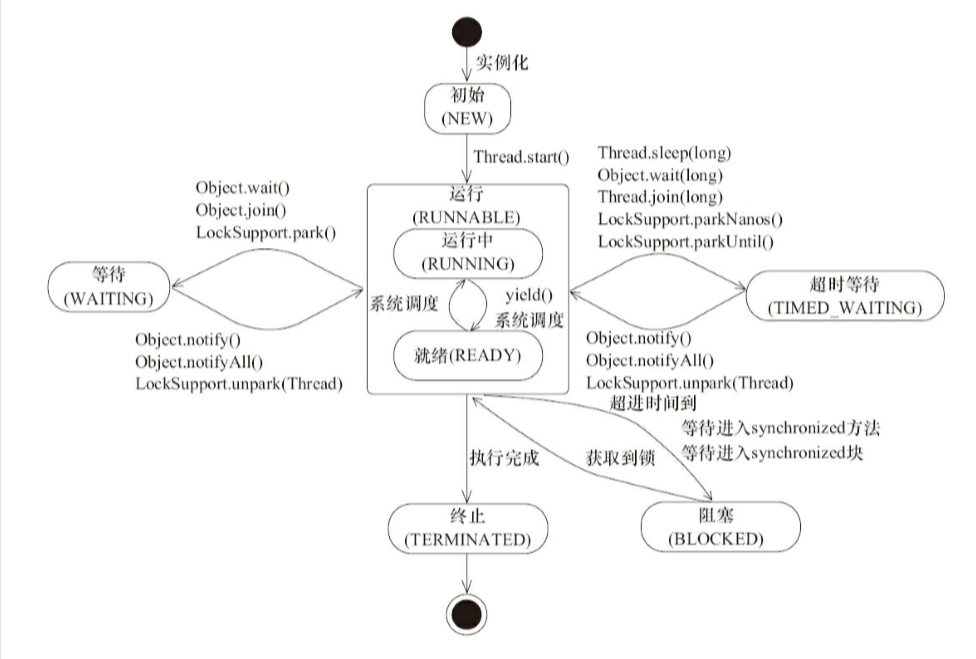

#  面试题

1. 线程的状态

   

2. 重入锁的实现，重入锁存储在哪里

   1. 每一个锁关联一个线程持有者和计数器，计数器为0代表没有加锁，计数器不为0代表有锁
   2. **ReentrantLock** 继承自AbstractQueuedSynchronizer类

3. AbstractQueuedSynchronizer实现原理

   1. AQS使用一个int变量表示同步状态
   2. 内置的FIFO双向队列完成资源获取线程的排队工作
   3. 子类继承AQS，使用getState，setState，compareAndSetState进行同步状态的更新操作，AQS可以保证通过这3个方法改变状态是安全的
   4. 既可以支持独占式地获取同步状态，也可以支持共享式地获取同步状态
   5. 锁是面向使用者的，它定义了使用者与锁交互的接口，隐藏了实现细节。同步器面向的是锁的实现者，它简化了锁的实现方式，屏蔽了同步状态管理、线程的排队、等待与唤醒的底层操作。
   6. 同步器基于模板方法设计，主要提供3类模板方法
      1. 独占式获取与释放同步状态
      2. 共享式获取与释放同步状态
      3. 查询同步队列中等待线程情况
   7. compareAndSetTail自旋方法确保节点能够被线程安全添加。
   8. 节点进入同步队列之后，就进入一个自旋的过程，每个节点都在自省的观察，当条件满足，就获取到同步状态。
   9. 头结点是成功获取到同步状态的节点，而头结点的线程在释放了同步状态之后，将会唤醒其后继节点，后继节点的线程被唤醒后需要检查自己的前驱节点是否是头结点

4. hashmap，hashtable，concurrentHashMap,为什么使用红黑树

   1. hashmap，非线程安全，允许一个null键和多个null值。
   2. hashtable类似hashmap，线程安全的，并发性低，因为使用了synchronized锁住了整张hash表
   3. concurrentHashMap允许多个修改操作并发进行，关键使用的分段加锁的技术(锁分离技术)，将hash表分割为多个Segment段，每个段其实就是一个小的hashtable，他们有自己的锁，只要多个修改操作发生在不同的段，它们就可以并发的进行。
   4. concurrentHashMap不在对象层次加锁，只对hash表的某个key加锁。
   5. 当hashmap链表长度大于8的时候，会将链表转化为红黑树，加快检索速度。

5. arrayList的实现，如何扩容的

   1. 基于数组实现
   2. 复制数组，默认扩容50%+1

6. 一致性哈希的了解

7. mysql数据库索引的数据结构，为啥使用B+树

   1. B树在提高了IO性能的同时并没有解决元素遍历的效率低下的问题，而由于B+数，所有的数据都是存储在叶子节点，并且叶子节点使用链表链接在一起，解决了遍历的问题。

8. 算法题：找出数据中重复的数字

   ```java
   public class Solution {
       // Parameters:
       //    numbers:     an array of integers
       //    length:      the length of array numbers
       //    duplication: (Output) the duplicated number in the array number,length of duplication array is 1,so using duplication[0] = ? in implementation;
       //                  Here duplication like pointor in C/C++, duplication[0] equal *duplication in C/C++
       //    这里要特别注意~返回任意重复的一个，赋值duplication[0]
       // Return value:       true if the input is valid, and there are some duplications in the array number
       //                     otherwise false
       // 把扫描的每个数字(例如数字m)放到其对应下表的位置上，若同一位置有重复，则说明该数字有重复
       public boolean duplicate(int numbers[],int length,int [] duplication) {
           if(numbers==null||length<=0)
               return false;
           for(int a:numbers){
               if(a<0||a>=length)
                   return false;
           }
             
           int temp;
           for(int i=0;i<length;i++){
               while(numbers[i]!=i){
                   if(numbers[numbers[i]]==numbers[i]){
                       duplication[0]=numbers[i];
                       return true;
                   }
                   temp=numbers[i];
                   numbers[i]=numbers[temp];
                   numbers[temp]=temp;
               }
           }
           return false;
       }
   }
   ```

   

   

9. 如何最小空间存储ip地址

   转化为整数现实，long类型，ip转成 Ax256x256x256+Bx256x256+Cx256+D，相当于分别将ip各地址段左移32位，16位，8位，0位，

   反向转换为右移24位，得到第一部分，然后将高8位置为0，然后右移16位，得到第二部分，然后将高16位置为0，然后右移8位得到第三部分，最后将高24位置为0，得到最后一部分。

1. java集合的问题，几个集合类的顶级接口是什么

2. 垃圾收集算法

    1. 标记清楚
    2. 标记整理
    3. 复制算法
    4. 分代收集
        1. 

3. 频繁fullGc如何解决

4. 单例模式

    1. 饿汉
    ```java
    public class Singleton{
        private static final  Singleton instance = new Singleton();
        
        public static Singleton getInstance(){
            return instance;
        }
    }
    ```
    1. 懒汉
        ```java
        public class Singleton{
            private static Singleton instance = null;
            
            private Singleton(){
            }
            
            public static Singleton getInstance(){
                if(instance == null){
                    instance = new Singleton();
                }
                return instance;
            }
        }
        ```
    1. DLC
        
        ```java
        public class Singleton{
            private volatile static Singleton instance;
            
            private Singleton(){
            
            }
            
            public staic Singleton getInstance(){
                if(instance == null){
                    Synchronized(Singleton.class){
                        if(instance == null){
                            instance = new Singleton();
                        }
                    }
                }
                return instance;
            }
        }
        ```
        
    1. 静态内部类的

        ```java
            public class Singleton(){
                private static class Holder{
                    public static final Singleton instance = new Singleton();
                }
                
                public static Singleton getInstance(){
                    return Holder.instance;
                }
            }
        
        ```

5. 单链表的倒序输出

    1. 先反转链表，然后在遍历链表输出
    2. 利用栈，压栈，出栈在逐个输出即可

6. 移动0

    1. 双指针法

7. 二叉树的深度优先遍历和层序遍历

    1. 深度优先遍历
       1. 前序遍历，根左右
        ```java
            class TreeNode{
                public int val;
                public TreeNode left;
                public TreeNode right;
                public TreeNode(int x){val = x};
            }
            
            class solution{
                public List<Integer> preOrderTraversal(TreeNode root){
                    List<Integer> result = new ArrayList<>();
                    preOrder(root,result);
                    return result;
                }
                
                private void preOrder(TreeNode root,List<Integer> result){
                if(root != null){
                    result.add(root.val);
                    preorder(root.left,result);
                    preorder(root.right,result);
                }
                }
            }

        ```
        
       2. 中序遍历，左中右
        ```java
        
        代码同上，只需要变更这个地方代码的顺序即可
        preorder(root.left,result);
        result.add(root.val);
        preorder(root.right,result);

        ```
       
       3. 后序遍历，左右中
       ```java
        代码同上，只需要变更这个地方代码的顺序即可
        preorder(root.left,result);
        preorder(root.right,result);
        result.add(root.val);
       ```
    1. 广度优先遍历即层序遍历
        ```java
            class Solution {
                public List<List<Integer>> levelOrder(TreeNode root) {
                    List<List<Integer>> result = new ArrayList<>();
                    if(root == null) return result;
                    LinkedList<TreeNode> queue = new LinkedList<>();
                    queue.offer(root);
                    while(!queue.isEmpty()){
                        int count = queue.size();
                        List<Integer> list = new ArrayList<Integer>();
                        while(count > 0){
                            TreeNode node  = queue.poll();
                            list.add(node.val);
                            if(node.left != null){
                                queue.offer(node.left);
                            }
                            
                            if(node.right != null){
                                queue.add(node.right);
                            }
                            count --;
                        }
                        result.add(list);
                    }
                    
                    return result;
                }
            }
        ```

1. 二分查找
    ```java
        int BinarySearch(int array[],int n,int value){
            int left = 0;
            int right = n-1;
            while(left <= right){
                int middle = (right-left)/2+left;
                if(array[middle] > value){
                    right = middle -1;
                }else if(array[middle] < value){
                    left = middle +1;
                }else{
                    return middle;
                }
            }
            
            return -1;
        }
    ```

2. 数据的局部最大值问题
    
    ```java
        int localMaxNum(int[] nums,int size){
            int left = 0;
            int right = size -1;
            int mid;
            while(left < right){
                mid = (left + right)/2;
                if(nums[mid] > nums[mid+1]){
                    right = mid;
                }else{
                    left = mid +1;
                }
            }
            return nums[left];
        }
    ```

3. 数组实现加1算法
    
    ```java
    class solution{
        public int[] plusOne(int[] nums){
            int index = nums.length - 1;
            do{
                if(nums[index] != 9){
                    nums[index] += 1;
                    return nums;
                }else{
                    nums[index] = 0;
                    index --;
                }
            }while(index >= 0);
            
            //说明原数组全部都是9
            if(index == -1){
                int[] array = new int[nums.length +1];
                array[0] = 1;
                System.arraycopy(nums,0,array,1,nums.length);
                return array;
            }
            
            return nums;
        }
    }
    
    ```

4. 为什么设置堆内存最小值

5. 手写sql，主要考察max，min，having等关键字的用法

6. http get和post的区别

7. 查询树的深度

   ```java
   class Solution{
        public int maxDepth(TreeNode root){
            return root == null?0:Max.max(maxDepth(root.left),maxDepth(root.right))+1
        }
   }
   ```  
   
   ```java
   //判断是否是平衡二叉树
   class Solution{
    private boolean isBalanced = true;
    
    public boolean isBalanced(TreeNode root){
        getDepth(root);
        return isBalanced;
    }
    
    private int getDepth(TreeNode root){
        if(root == null) return 0;
        
        int left = getDepth(root.left);
        int right = getDepth(root.right);
        
        if(Math.abs(left-right) > 1){
            isBalanced = false;
        }
        
        return right > left?right+1:left+1;
    }
   }
   ```

15. 两个队列实现栈的功能，两个栈实现队列
    * 两个栈模拟队列
        ```java
            /**
            * 入队直接入stack1
            * 出队，先判断stack2是否为空，如果为空，则将stack1全部弹出并压入栈2，如果不为空，则直接弹出stack2的元素
            */
            public class StackToQueue{
                Stack<Integer> stack1 = new Stack<Integer>();
                Stack<Integer> stack2 = new Stack<Integer>();
                
                public void offer(int x){
                    stack1.push(x);
                }
            
                public int poll(){
                    if(pSize() != 0){
                        if(stack2.isEmpty()){
                            stack1ToStack2();
                        }
                        return stack2.pop();
                    }else{
                        System.out.println("队列为空，无法出队");
                        return -1;
                    }
                }
                
                public void stack1ToStack2(){
                    while(!stack1.isEmpty()){
                        stack2.push(stack1.pop());
                    }
                }
                
                public int pSize(){
                    return stack1.size()+stack2.size();
                }
            }
        ```
        
    * 两个队列模拟栈
        q1,q2连个队列，出队，就是把n-1个元素入到空队列，剩下的第n就变成了对头，就可以直接出来了，相当于是出栈操作
        ```java
            public class QueueToStack{
                LinkedList<Integer> queue1 = new LinkedList<Integer>();
                LinkedList<Integer> queue2 = new LinkedList<Integer>();
                public void push(Integer value){
                    queue1.addLast(value);
                }
                
                public Integer pop(){
                    if(sSize()!=0){
                        if(!queue1.isEmpty()){
                            putN_1ToAnthor();
                            return queue1.poll();
                        }else{
                            putN_1ToAnthor();
                            return queue2.poll();
                        }
                    }else{
                        return -1;
                    }
                }
                
                public int size(){
                    return queue1.size()+queue2.size();
                }
                
                public void putN_1ToAnothor(){
                    if(!queue1.isEmpty()){
                        while(queue1.size()>1){
                            queue2.addLast(queue1.removeFirst());
                        }
                    }else if(!queue2.isEmpty()){
                        while(queue2.size() > 1){
                            queue1.addLast(queue2.removeFirst());
                        }
                    }
                }
            }
        ```

25. 打印二叉树的所有路径
    先序遍历
    ```java
    class TreeNode{
        public int val;
        public TreeNode left;
        public TreeNode right;
        public TreeNode(int x){val = x};
    }
    
    class solution{
        public List<String> binaryTreepaths(TreeNode root){
            List<String> result = new LinkedList<>();
            binaryTreePath(root,null,result);
            return result;
        }
        
        private void binaryTreePath(TreeNode root,String path,List<String> result){
            if(root == null){
                return;
            }
            
            path = (path == null)?String.valueOf(root.val):path+"->"+root.val;
            if(root.left == null && root.right == null){
                result.add(path);
                return;
            }
            
            binaryTreePath(root.left,path,result);
            binaryTreePath(root.right,path,result);
        }
    }
    
    ```
    
1. redis相关
2. 动态规划和贪心算法
    1. 跳跃游戏
        ```java
           boolean canJump(int[] nums){
                if(nums.size() == 0) return 0;
                boolean result;
                int next = 0;
                for(int i=0;i<nums.length;i++){
                    next = max(next,i+nums[i]);
                }
                
                return (next > nums.length-1)?true:false 
           }
        ```
        
    1. 跳跃游戏2:求取跳跃所需要的次数
    ```java
        int canJump(int[] nums){
            if(nums.size() == 0) return 0;
            int jump = 0;
            int current = 0;
            int next = 0;
            for(int i=0;i<nums.length;i++){
                if(current < i){
                    ++jump;
                    current = next;
                }
                next = max(next,i+nums[i]);
            }
                return jump; 
           }
    ```
    
        ```java
        //动态规划的方式
        //dp[i] 在i点记录，i点之前的步数是否可以走到i点，true或false
            if (nums == null || nums.length == 0) {
                return false;
            }
            int len = nums.length;
            boolean[] dp = new boolean[len];
            dp[0] = true;//初始化
            for (int i = 0; i < len; i++) {
                for (int j = 0; j < i; j++) {
                    //从j到i，需要两个条件：j点可以到达（dp[j]=true）,nums[j]的值要>=j到i的距离
                    if (dp[j] && (nums[j] >= i - j)) {
                        dp[i] = true;
                        break;
                    }
                }
            }
            return dp[len - 1];
        ```
        
        * 反转链表

        ```java
        private ListNode reverse(ListNode head){
            if(head.next == null){
                return head;
            }
            ListNode prev = null;
            ListNode cur = head;
            while(cur != null){
                ListNode tempNext = cur.next;
                cur.next = prev;
                prev = cur;
                cur = tempNext;
            }
            return prev;
        }
        ```
    